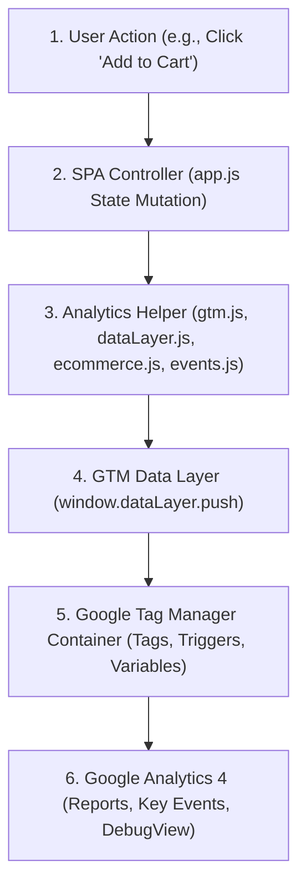

# Analytics Layered Architecture

This document describes how telemetry and e-commerce tracking data flows through the Amazon Clone application layers.

---

## 1. Data Flow Architecture

The analytics system is divided into five modular layers, ensuring that business logic is decoupled from tracking targets.

---

## 2. Layer Analysis

### Layer 1: User Action
- **Description**: The interface level where user clicks buttons, searches, or inputs forms.
- **Responsibility**: Listens to standard events (e.g., `submit`, `click`, `keypress`).

### Layer 2: SPA Controller (`src/app.js`)
- **Description**: Frontend state coordinator that executes the e-commerce logic (e.g., mutating the cart in memory, executing SPA screen routing, hitting the Node.js API).
- **Responsibility**: Invokes the dedicated analytics helpers at the precise completion phase of actions (e.g., firing `add_to_cart` only after successfully updating the state and local storage).

### Layer 3: Analytics Helpers (`src/analytics/`)
- **Description**: A wrapper library that encapsulates GA4 Enhanced Ecommerce specs.
- **Responsibility**:
  - Validates e-commerce data structures.
  - Clears stale variables from the tag manager queue before loading new payloads.
  - Scrubs and masks sensitive elements (PII protection).

### Layer 4: Data Layer
- **Description**: The JavaScript queue (`window.dataLayer`) acting as GTM's input.
- **Responsibility**: Maintained as an in-memory queue. Broadcasts events to the local debug console overlay when debug configurations are active.

### Layer 5: Google Tag Manager (GTM)
- **Description**: The tag manager container where triggers map variables to GA4 event tags.
- **Responsibility**: Consumes events, resolves variables (e.g., reading `ecommerce.items`), and fires tags dynamically.

### Layer 6: Google Analytics 4 (GA4)
- **Description**: The final telemetry data repository.
- **Responsibility**: Performs analytics aggregations, tracks conversion funnels, and maps key conversions like `purchase`.
