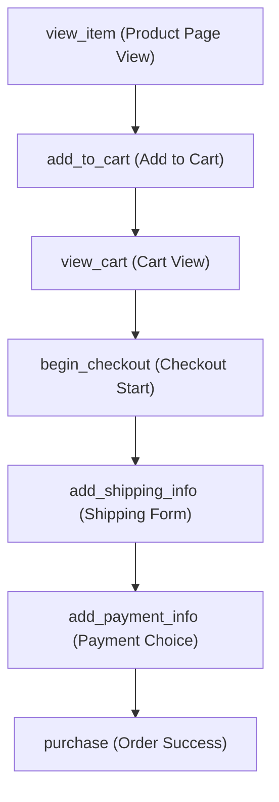

# E-Commerce Tracking Plan (GA4 & GTM)

This document contains the strategic measurement framework and event taxonomy designed for the Amazon Clone application. It serves as the single source of truth for both developers and analysts to understand how user interactions map to business goals.

---

## 1. Business Objectives & Measurement Strategy

Our primary objective is to build a high-performance analytics system that measures user engagement and purchase conversion funnels accurately.

### Core Goals
- **Conversion Optimization**: Identify drop-off points in the e-commerce purchase funnel.
- **Product Discovery**: Analyze which categories, listings, and search terms generate the most engagement.
- **User Engagement**: Track how sign-ins, product details views, and cart updates correlate with purchasing behavior.
- **System Stability**: Ensure that analytics script load failures do not block core checkout actions.

---

## 2. The Conversion Funnel

The implementation tracks a complete 7-stage e-commerce funnel, enabling conversion rate metrics for each transitions.

---

## 3. Event Taxonomy

| Event Name | Type | Description / Trigger | Key Parameters | Business Value |
| :--- | :--- | :--- | :--- | :--- |
| **page_view** | Core | SPA screen transition | `page_location`, `page_path`, `page_title` | Page engagement analysis |
| **view_item_list** | E-commerce | Rendering product grids (Home, Search) | `item_list_id`, `item_list_name`, `items` | Grid click-through rate analysis |
| **select_item** | E-commerce | User clicks a product details link | `item_list_id`, `item_list_name`, `items` | Product interest tracking |
| **view_item** | E-commerce | User opens a product page | `currency`, `value`, `items` | Detail page views analysis |
| **add_to_cart** | E-commerce | Successful add to cart operation | `currency`, `value`, `items` | Purchase intent signal |
| **remove_from_cart**| E-commerce | User clicks delete or decreases qty to 0 | `currency`, `value`, `items` | Cart friction indicator |
| **view_cart** | E-commerce | User opens the cart page | `currency`, `value`, `items` | Cart abandonment analysis |
| **begin_checkout** | E-commerce | Clicking "Proceed to checkout" | `currency`, `value`, `items` | Checkout funnel entrance |
| **add_shipping_info**| E-commerce | Submit shipping details form | `currency`, `value`, `shipping_tier`, `items` | Shipping friction analysis |
| **add_payment_info** | E-commerce | Submit payment selection details | `currency`, `value`, `payment_type`, `items` | Payment choice tracking |
| **purchase** | Key Event | Successful API order creation and paid status | `transaction_id`, `value`, `tax`, `shipping`, `items` | Primary conversion rate (Revenue) |
| **search** | Custom | User searches with navbar input | `search_term` | Customer search intent analysis |
| **login** | Custom | Mock user signs in successfully | `method` | Authenticated session analysis |
| **sign_up** | Custom | Mock user creates a new account | `method` | Account registration growth |

---

## 4. Key Performance Indicators (KPIs)

1. **Purchase Conversion Rate (PCR)**: `(purchase events / page_view events) * 100`
2. **Cart Abandonment Rate (CAR)**: `((begin_checkout - purchase) / begin_checkout) * 100`
3. **Product Detail Click-Through Rate (CTR)**: `(select_item / view_item_list) * 100`
4. **Average Order Value (AOV)**: `Total Revenue / Total purchase events`

---

## 5. Privacy & Data Integrity

- **No PII Transmission**: Email addresses, passwords, phone numbers, and full home street details are stripped at the dataLayer level or masked (e.g. `[EMAIL_MASKED]` in search terms).
- **Price Integrity**: All values pushed during `purchase` are fetched directly from the backend order system response. Client-side variables are never trusted for transaction reporting.
- **De-duplication**: The purchase event fires only once per unique Transaction ID using `localStorage` caching of transaction IDs.
